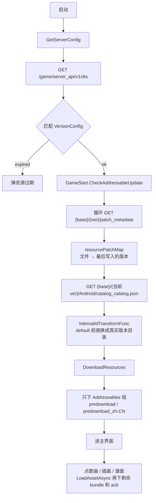
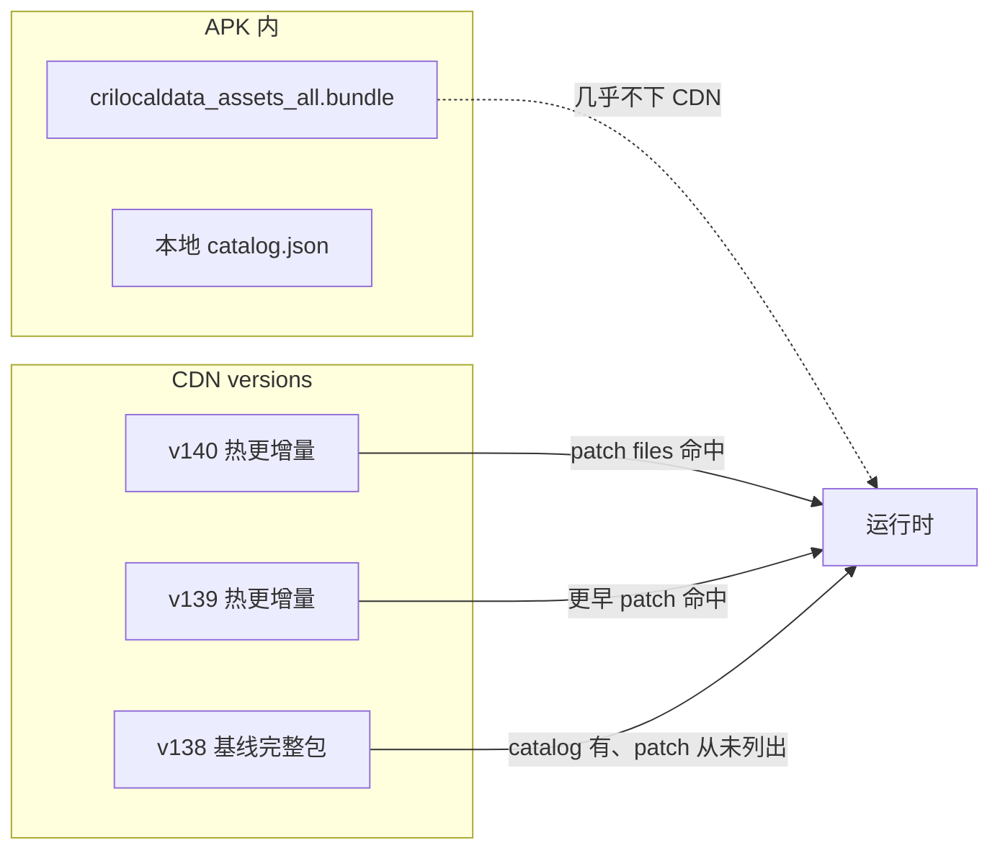
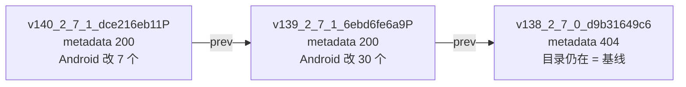
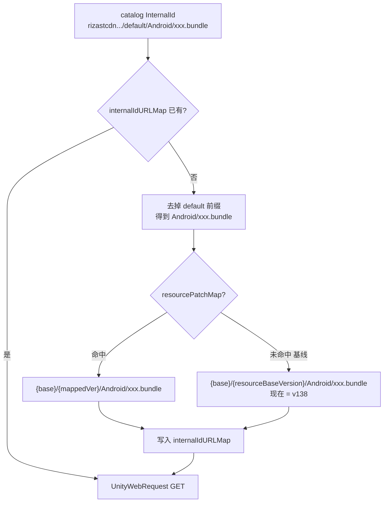

# Rizline 国服资源下载流程

入口在 IL2CPP：`GetServerConfig`、`PigeonSDKGameConfig`、`GameStart`（Addressables）。
离线对照：`E:\rizline-assets-get\main.py`。

下文 `{base}` = `resourceBaseUrl`，`{ver}` = `resourceVersion`。
实测日期 2026-09-06，客户端 `2.7.1`，`{ver}` = `v140_2_7_1_dce216eb11P`。

---

## 总览



游戏**不会**一次性下完 catalog 里所有远程文件。启动只保证 `predownload`；其余按需拉。



---

## 1. 版本配置

类：`PigeonSDKGameConfig`、`ServerConfig`、`VersionConfig`。`GetServerConfig.Start()` 先 ping，再拉配置。

### 接口

```
GET https://rizserver.pigeongames.net/game/server_api/v1/dis
```

| 头 | 值 |
| --- | --- |
| `game_id` | `pigeongames.rizline` |
| `channel_id` | 渠道，如 `11` |
| `i18n` | `zh-CN` |

| 备份 | URL |
| --- | --- |
| 主配置备份 | `https://rizlineasset.pigeongames.net/configs/game_config_cn.json` |
| 审核配置 | `https://rizlineasset.pigeongames.net/configs/review_config_cn_MfBdz4mYo8UpYGbG31LZ4Tey5AVPouMR.json` |

### 返回（实测精简）

```json
{
  "configs": [{
    "version": "2.7.1",
    "resourceUrl": "https://rizlineasset.pigeongames.net/versions/v140_2_7_1_dce216eb11P",
    "resourceBaseUrl": "https://rizlineasset.pigeongames.net/versions",
    "resourceVersion": "v140_2_7_1_dce216eb11P"
  }],
  "minimalVersion": "2.7.1"
}
```

`resourceUrl` = `{base}/{ver}`，就是当前资源目录。dump 里 `VersionConfig` 还有 `platform` / `expired` / `inReview` / `maintenanceInfo`，这次接口没返回；`expired=true` 时客户端会弹资源过期。

---

## 2. 热更补丁链

类：`GameStart.LoadResourcePatches`、`LoadResourcePatchMetadata`。
类型：`ResourcePatchMetadata`（`version` + `files`）、`ResourcePatches`。

```
GET {base}/{ver}/patch_metadata
```

正文是纯文本，不是 JSON：

```
{上一版目录名}
Android/xxxx.bundle
Android/catalog_catalog.json
iOS/xxxx.bundle
...
```

| 行 | 含义 |
| --- | --- |
| 第 1 行 | **上一版** `{ver}` |
| 之后 | 相对上一版改过的文件，`Android/...` 与 `iOS/...` 成对出现 |

循环直到某版 `patch_metadata` **404**。注意：404 的那一版**目录往往还在**，基线文件就放在那里。链终点取「最后一份成功 metadata 里写下的 prev」，不是「还能拉到 metadata 的最旧版」。该 prev 记为 `GameStart.resourceBaseVersion`。

目前还能拉到的热更 metadata 只有两层（v138 起 404，文件数不可列目录）：

| 版本 | Android | iOS | 合计 |
| --- | --- | --- | --- |
| v140 | 7 | 7 | 14 |
| v139 | 30 | 30 | 60 |
| 行数相加 | | | 74 |
| **去重路径** | **35** | **35** | **70** |

去重少 4 条：两版都写了 `catalog_catalog.json` / `.hash`（Android+iOS）。国服按 Android 算热更 **35**（含 2 条 catalog；资源 bundle/acb 为 **33**）。

实测链：



得到 `resourcePatchMap`：文件相对路径 → **最后一次出现在 `files[]` 里的版本**。

静态字段：`resourceBaseUrl`、`resourceBaseVersion`、`resourcePatchMap`、`internalIdURLMap`。

---

## 3. Catalog

```
GET {base}/{当前ver}/Android/catalog_catalog.json
```

Unity Addressables `ContentCatalogData`。APK 里也有 `assets/aa/catalog.json`，运行时以 CDN 当前版为准。

### `m_InternalIds` 构成（3024 条，无重复）

| 类型 | 数量 | 要不要下 CDN |
| --- | --- | --- |
| `http://.../*.bundle` | 1319 | 要，远程 bundle |
| `http://.../*.acb=...` | 156 | 要，远程音频 |
| **远程合计** | **1475** | 全量 HEAD 见第 6 节 |
| 32 位哈希 | 1318 | 否，内部 id，和远程 bundle 大致一一对应（1319 vs 1318） |
| `Assets/` 等本地路径 | 188 | 否，资源 key / 本地引用 |
| 其它字符串 | 42 | 否，如 `ApplicationVariables` |
| RuntimePath 本地 bundle | 1 | APK 内 `crilocaldata` |

远程 InternalId 一律写成占位前缀：

```
http://rizastcdn.pigeongames.cn/default/Android/{hash}.bundle
http://rizastcdn.pigeongames.cn/default/Android/cridata_assets_criaddressables/{name}.acb={checksum}.bundle
```

`rizastcdn.../default/` **不能访问**（HEAD 502 / 断连）。真实主机是 `{base}`。

加载 catalog 后：`CheckForCatalogUpdates` → 必要时 `UpdateCatalogs`，再按 key 下依赖。

---

## 4. 非热更 / 基线文件

**是 CDN 文件，几乎不在 APK。** 当前 APK `assets/aa/Android/` 只有 `crilocaldata_assets_all.bundle`。

`patch_metadata.files` 只列相对上一版**改过**的文件。catalog 远程项对不上任何一版 `files[]` 的，就是基线。

当前 catalog 的 1475 条远程 InternalId 和热更表对上之后：

| | 条数 | v140 | v139 | v138（`resourceBaseVersion`） |
| --- | --- | --- | --- | --- |
| 出现在 Android `files[]`（不含 catalog.json/hash） | 29 | 命中则 **200** | 更早命中则 200 | 不一定 |
| 从未出现在能拉到的 `files[]`（基线） | **1446** | **404** | **404** | **200** |

Android 热更 unique **35** 拆开：

- `catalog_catalog.json` / `.hash`：2，不在 1475 条资源 InternalId 里
- 出现在当前 catalog 远程项里： **29**（游戏会从 v139/v140 拉）
- 写在 `files[]` 但当前 catalog 的 `http` 列表里没有：4（多半是已换 hash、catalog 不再引用的旧包）

例：

- 热更 `Android/1018a951....bundle` → `.../v140_.../Android/1018a951....bundle` 200
- 基线 `Android/00108990....bundle` → v140/v139 404，`.../v138_2_7_0_d9b31649c6/Android/00108990....bundle` 200（42407 字节）

没有单独的「下基线包」接口。基线和热更走同一套 Addressables 下载，只是 URL 换到不同版本目录。

### 客户端怎么下

1. `LoadResourcePatches` 沿 `patch_metadata` 走到终点，把终点的 prev 目录记成 `GameStart.resourceBaseVersion`（现在是 `v138_2_7_0_d9b31649c6`）。出现在某版 `files[]` 里的文件进 `resourcePatchMap`。
2. 挂上 `InternalIdTransformFunc`（`GameStart.<>c.<CheckAddressableUpdate>b__23_4`）。每次 Addressables 要下某个 InternalId：
   - 已在 `internalIdURLMap` 里 → 直接用缓存 URL
   - 否则剥掉占位前缀 `http://rizastcdn.pigeongames.cn/default/`，剩下相对路径
   - 相对路径在 `resourcePatchMap` → `{base}/{mappedVer}/{相对路径}`
   - **不在 map 里（基线）** → `{base}/{resourceBaseVersion}/{相对路径}`
   - 结果写进 `internalIdURLMap`，下次不再算
3. 真正发 HTTP 的仍是 `Addressables.DownloadDependenciesAsync` / `LoadAssetAsync`（UnityWebRequest）。启动只拉 `predownload` 依赖里的基线文件；点歌曲再拉其余。

所以基线不是「从当前 ver 一路 404 试下去」。游戏一次性指向链终点那个完整目录。离线脚本 `_download_base_file` 会先试 `allServerVer[-1]`（最旧），失败再从新到旧扫，用来兜 CDN 个别缺文件。



例：基线 `00108990....bundle`

```
GET https://rizlineasset.pigeongames.net/versions/v138_2_7_0_d9b31649c6/Android/00108990bec00468c773c8824f895f51.bundle
```

不是 v140，也不是 `rizastcdn/default`。

v139 热更里有 2 条 Android acb，这些走 mappedVer；其余 acb 走基线目录。无论哪一层，HTTP 路径都必须保留子目录，并**去掉 catalog 末尾的 `.bundle`**：

```
{base}/{ver}/Android/cridata_assets_criaddressables/{name}.acb={checksum}
```

带 `.bundle` 或去掉 `cridata_assets_criaddressables/` 都会 404。

---

## 5. 启动下载 vs 按需下载

`GameStart.DownloadResources(isRetry)`：

1. key：`predownload`、`predownload_` + i18n（如 `predownload_zh-CN`）
2. `GetDownloadSizeAsync` 算差量；流量不够提示
3. `DownloadResourcesByKey` → `Addressables.DownloadDependenciesAsync(key)`

`LoadOver()` 后进主界面。点歌曲 / 插画 / 谱面再 `LoadAssetAsync`，按改写后的 URL 拉剩余文件。

---

## 6. 全量远程文件可达性（只 HEAD，不下包）

这是离线探测的试法（脚本从新到旧 HEAD）。**游戏不会这样试**，基线一次指向 `resourceBaseVersion`。

对当前 catalog 全部 **1475** 条 `http` InternalId，按 v140 → v139 → v138 试：

| | 成功 | 总数 |
| --- | --- | --- |
| `.bundle` | 1318，重试后 **1319** | 1319 |
| `.acb=` | **156** | 156 |
| **合计** | **1475** | **1475** |

第一次探测有 1 条 HEAD 返回 0（连接掐断）：`Android/1cf772d046bf707cf7b5936a08dbe544.bundle`。单独再探：v140/v139 为 `NoSuchKey`，**v138 为 200（11289 字节）**。所以远程项都能在链上某层下到，不是缺文件。

这 1475 **不等于** catalog 全量 3024：多出的 1549 条是哈希 / 本地路径 / 逻辑名，不是独立 CDN 对象。

---

## 7. URL 拼法

| 文件 | URL |
| --- | --- |
| 版本配置 | `https://rizserver.pigeongames.net/game/server_api/v1/dis` |
| 补丁表 | `{base}/{ver}/patch_metadata` |
| Catalog | `{base}/{当前ver}/Android/catalog_catalog.json` |
| 热更 bundle | `{base}/{最后写入它的 ver}/Android/{hash}.bundle` |
| 基线 bundle | `{base}/{链终点 prev}/Android/{hash}.bundle` |
| 音频 | `{base}/{对应 ver}/Android/cridata_assets_criaddressables/{name}.acb={checksum}`（去掉 catalog 里的 `.bundle`） |

---

## 8. 和离线脚本的对应

`rizline-assets-get/main.py`：

1. `getRizlineVersion()` → `/game/server_api/v1/dis`
2. 下 `{base}/{ver}/Android/catalog_catalog.json`
3. 循环 `patch_metadata`，收集历史版本和每版 `files`
4. 先下各热更 `files[]`
5. 再扫全部 `http` InternalId，把 `rizastcdn.../default` 换成 `{base}/{尝试的版本}`，从新到旧直到 200
6. `parse_catalog` / `parse_level` / `export_all_resources`

游戏启动只做 1–3 + `predownload` 子集；脚本会把 1475 条远程尽量全部拉完。

---

## 9. 关键类

| 类 | 作用 |
| --- | --- |
| `PigeonSDKGameConfig` | 配置 URL 常量 |
| `ServerConfig` / `VersionConfig` | 版本 JSON |
| `GetServerConfig` | 启动拉配置 |
| `GameStart` | 补丁链、catalog、predownload |
| `GameStart.ResourcePatchMetadata` | `version` + `files` |
| `Addressables.DownloadDependenciesAsync` | 按 key 下依赖 |

字符串：`server_api/v1/dis`、`/patch_metadata`、`predownload`、`predownload_`、`http://rizastcdn.pigeongames.cn/default/`、`game-resource-expired`、`game-resource-ver`。
